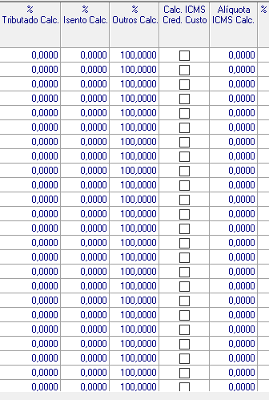
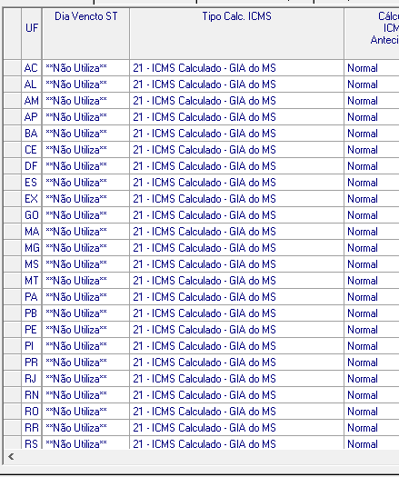

# Documento Técnico da Grade de Tributação por UF

## Introdução

Com o objetivo de proporcionar maior clareza e compreensão sobre a Grade de Tributações por Unidade da Federação (UF), documentamos as informações essenciais para a estruturação dos processos da empresa. Dessa forma, identificamos uma abordagem que permite consolidar o conhecimento e as informações necessárias para serem aplicadas no trabalho com a base de tributação. Este documento visa oferecer um guia sólido e consistente para a equipe, otimizando a execução de tarefas relacionadas à tributação e promovendo eficiência nos processos.

### 1. Objetivos

A padronização de processos em nossa equipe facilitará a contribuição para os resultados e a comunicação na linguagem entre os colaboradores, visando adotar, entre as análises, configurações e/ou parametrizações, a mesma sistemática de entendimento na execução de tarefas.

Este documento contém informações de grande importância para a organização, que mantém como padrão o processo de validação da grade de tributação por UF e suas configurações para diferentes cenários.

> É válido para os analistas na área tributária, garantindo que o andamento dos processos contenha a mesma visão de trabalho para uma melhor fluidez.

### 2. Metodologia

Como detentores do conhecimento geral sobre as configurações na grade de UF, o departamento tributário continua com a leitura e interpretação da legislação vigente no estado de localização de nossos clientes.

Realiza a identificação das alíquotas aplicadas para a "Regra Geral" no estado, assim como para os diversos produtos sujeitos a diferentes alíquotas e os benefícios fiscais aplicáveis a alguns produtos. Estes benefícios incluem:

1. **FECOEP (FCP):**
Fundo Estadual de Combate e Erradicação da Pobreza (ou Fundo de Combate à Pobreza):
Embora não represente um benefício direto para as empresas, a contribuição para o FCP é uma obrigação tributária adicional que financia ações e programas sociais voltados ao combate da pobreza.

2. **Reduções de Base de Cálculo:**
Consistem em diminuir o valor sobre o qual o imposto é calculado. Essa redução pode ser aplicada a determinadas operações ou produtos, visando estimular setores específicos, como a redução da carga tributária sobre insumos essenciais.

3. **Isenções:**
Isenção tributária significa a dispensa do pagamento de determinado tributo. Pode ser concedida a produtos, operações ou setores específicos, com o objetivo de estimular atividades econômicas, reduzir custos ou promover o desenvolvimento.

4. **Créditos Outorgados:**
Benefícios fiscais concedidos automaticamente pelo governo, sem a necessidade de cumprir condições específicas. Podem incluir reduções de alíquotas, isenções ou créditos tributários aplicados automaticamente para incentivar certas atividades ou setores.

5. **Diferimentos:**
O diferimento tributário permite o adiamento do pagamento do imposto para uma fase posterior da cadeia produtiva ou comercial. Isso é feito para evitar a oneração excessiva do processo produtivo, postergando o pagamento do tributo para uma etapa subsequente.

> As ferramentas utilizadas para aprofundamento das análises e processos específicos incluem a assessoria no site da Econet (http://www.econeteditora.com.br/), que possibilita a busca de informações de forma mais rápida. No entanto, a maior seguridade que temos é validar as informações diretamente pelo site da Fazenda do estado, tornando assim as informações ainda mais confiáveis.

#### 2.1 Metodologia/ Processo de parametrização

`ICMS Próprio`

Para a aplicação do ICMS, temos na tabela da Grade UF alguns campos relevantes para análises de alíquotas e benefícios. Seguem os códigos dos campos abaixo:

CÓDIGOS DO CAMPO DA TABELA: 
     
|***CAMPO***  |***LEGENDA*** | 
| ----------| --------------|
| PERTRIBUTADO | %Tributado |
| PERISENTO | %Isento |
| PEROUTRO | %Outros |
| PERALIQUOTA | Alíquota |
     
> Há o conhecimento de que são aplicadas reduções na cesta básica e em artigos compostos por benefícios fiscais que alcançam os fornecedores Fabricantes e Atacadistas, isenções, alíquotas internas, além de outros, quando aplicável para microempresas.

`MVA Original e MVA AJustado 12%`

Para a Substituição Tributária vale ressaltar algumas condições quando utilizado MVA Original ou Ajustado:

- Reduções interestaduais (Cesta básica - Artigo 3º: Todos os produtos que possuem redução de cesta básica em qualquer estado terão sempre MVA original. Esta é uma regra geral: quando a carga interna de ICMS próprio e ST for inferior a 12% da alíquota interestadual, ou seja, nunca se deve ajustar o MVA dos produtos da Cesta Básica). Esta redução se aplica a toda a cadeia, tanto nas entradas internas de ICMS próprio e ST quanto em todas as operações interestaduais.

- Reduções interestaduais (Redução de 33,33% - Artigo 30/34/39/61/66/75): O fisco paulista adota o entendimento de que, se o produto possui redução de alíquota interna, na operação interestadual o MVA original deve ser considerado. Isso ocorre porque a alíquota interna utilizada para o ajuste do MVA deve ser de 12%, igualando-se à alíquota interestadual. As regras para essa redução são aplicadas por estabelecimento fabricante ou atacadista, de maneira a garantir que a carga tributária corresponda ao percentual de 12%.

- Reduções interestaduais com o Suco de Laranja em SP: Nas saídas internas de suco de laranja (NCM 2009.1), está prevista a redução da base de cálculo, garantindo que a carga tributária corresponda a 12%, desde que cumpridos os requisitos legais do artigo 61 do Anexo II do RICMS/SP. Para esse caso, considera-se a MVA original. Além disso, há uma redução de 33,33% para toda a cadeia, conforme previsto para as saídas internas que reduzem a parte ST nas linhas interestaduais e internas. No Artigo 39, que trata da base de cálculo reduzida nas operações com preparações de produtos hortícolas, de frutas ou de outras partes de plantas do capítulo 20 da NCM, exceto suco de laranja classificado no código 2009.1 da NCM, a redução se aplica aos demais sucos.

- O MVA Ajustado é utilizado quando não há previsão de redução na carga tributária e a carga efetiva interestadual for menor que a carga efetiva interna. Nesse caso, realiza-se o ajuste da Margem de Valor Agregado para as operações interestaduais.

- No caso em que a alíquota interna seja igual à carga efetiva interestadual, o MVA será o Original, considerando a mesma margem de valor agregado.

> Abaixo estão os códigos utilizados na tabela ***consinco.map_tributacaouf***, referentes aos campos ST, a fim de manter um formato completo para MVA, Alíquota ST e Percentual Tributado ST. Dessa forma, ao apresentar os dados que precisam ser alterados e/ou corrigidos, eles podem ser copiados e encaminhados para a automatização.

CÓDIGOS DO CAMPO DA TABELA: 

|***CAMPO***  |***LEGENDA*** | 
| ----------| --------------|
| PERACRESCST | %Acresc.ST |
| PERALIQUOTAST | Alíquota ST |
| PERTRIBUTST | %Tribut.ST |

`MVA Importados (Resolução 13)`

Estabelece alíquotas do Imposto sobre Operações Relativas à Circulação de Mercadorias e sobre Prestação de Serviços de Transporte Interestadual e Intermunicipal e de Comunicação (ICMS), nas operações interestaduais com bens e mercadorias importados do exterior. Deve-se considerar algumas regras de aplicação dos valores de MVA que geralmente aocntecem dúvidas quando ao entendimento, como por exemplo:

|***ALÍQUOTA***  |***DESCRIÇÃO*** | 
| ----------| --------------|
| Alíquota 18% para 4% | Quando for uma operação em que não resulte redução interna.|
| Alíquota 12% para 4% | Quando ocorrer redução de 33,33% que resulte em 12% a carga tributária.|
| Alíquota 7% para 4%  |Quando ocorrer redução de Cesta Básica, resultante em carga tributária de 7%.|

> Para facilitar o trabalho da automatização em conjunto com o Tributário, abaixo são os códigos utilizados na tabela ***consinco.map_tributacaouf***, assim ao apresentar os dados que precisam ser alterados e/ou corrigidos, podem ser copiados e encaminhados para a automatização.

CÓDIGOS DO CAMPO DA TABELA: 

|***CAMPO***  |***LEGENDA*** | 
| ----------| --------------|
| PERACRESCSTRESOLUCAO13 | %Acresc.ST Resolução 13 |
| PERTRIBUTADORESOL13 | %Trib.Resol13 |
| PERISENTORESOL13 | %Isento Resol13 |
| PEROUTRORESOL13 | %Outros Resol13 |
| PERICMSRESOLUCAO13 | %ICMS Resolução 13 |

`FECOEP (FCP)`
 
 Esta alíquota nas operações destinadas a consumidor final localizado no Estado de São Paulo, serão somados dois pontos percentuais, destinados ao Fundo Estadual de Combate e Erradicação da Pobreza - totalizando, portanto, uma carga tributária de X%. O assunto encontra-se disciplinado no [artigo 56-C do RICMS/SP](http://www.econeteditora.com.br/icms_sao_paulo/livro1-art1a259.asp#art56c).

> O adicional de 2% na alíquota aplicável as operações destinadas a consumidor final são citados as seguintes mercadorias no artigo acima que são:  

> I - bebidas alcoólicas classificadas na posição 2203 da Nomenclatura Comum do Mercosul - NCM

> II - fumo e seus sucedâneos manufaturados, classificados no capítulo 24 da Nomenclatura Comum do Mercosul - NCM.
    
CÓDIGOS DO CAMPO DA TABELA: 

|***CAMPO***  |***LEGENDA*** | 
| ----------| --------------|
| BASEFCPST | Base FCP ST |
| PERALIQFCPST | Alíquota FCP ST |
| TIPCALCFCPST | Tipo Cálculo FCP ST |

`Parametrização do CALC em tributações de fornecedores optantes do Regime de Carne`

Conforme Decreto 62.647/2017 é vedado o aproveitamento de quaisquer outros créditos do imposto para estas aquisições, portanto, nas aquisições de carnes, o valor do ICMS destacado nas Notas Fiscais de aquisição o cliente não poderá tomar crédito causa essa da alíquota ser menor, precisando estar configurado da forma do registro de tela, abaixo⬇️:

> 